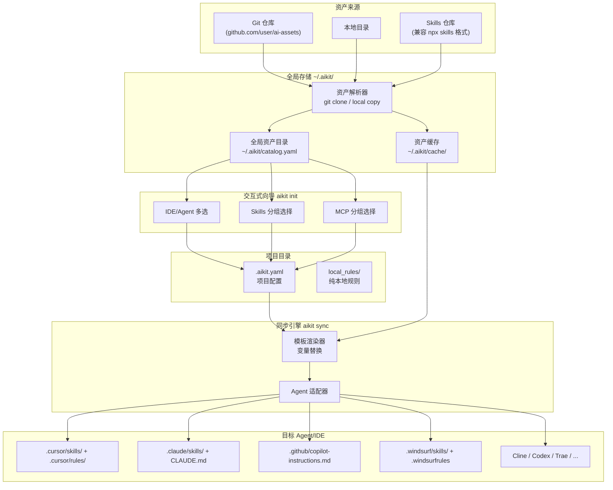

# aikit - 统一 AI 开发资产管理 CLI

## 1. 生态现状与定位

已有工具：

- **npx skills** (Vercel, 7.4k stars): 只管 skill 安装，支持 37+ agent，用 symlink/copy 分发
- **rule-porter**: 只做 Cursor rule 到 CLAUDE.md/AGENTS.md 的单次转换
- **ai-rulez**: 统一配置但生态小

**aikit 的定位**：不是替代 npx skills，而是做 **ALL AI 资产（skills + rules + MCP + secrets + templates）的统一管理器**，重点解决：

- 跨平台规则同步（rule-porter 只做单次转换，aikit 做持续同步）
- MCP 配置统一管理（目前无人做）
- 密钥管理（目前无人做）
- 项目模板化（资产组合 + 变量绑定）
- 兼容 Agent Skills 规范，可从 `npx skills` 生态的仓库安装 skills

## 2. 核心架构

核心流程分为三个阶段：**注册** → **选取** → **同步**。



**三阶段说明：**

1. **`aikit add`（全局注册）**：从 Git 仓库 / 本地目录解析资产，注册到全局资产目录 `~/.aikit/catalog.yaml`，并缓存资产文件到 `~/.aikit/cache/`
2. **`aikit init`（交互式选取）**：通过 TUI 向导从全局资产目录中选择 IDE、Skills、MCP，生成项目级 `.aikit.yaml`
3. **`aikit sync`（同步分发）**：根据 `.aikit.yaml` 配置，通过 Agent 适配器将资产同步到各目标 IDE


## 3. 资产类型定义

### 3.1 Skill（兼容 Agent Skills 规范）

格式完全兼容 `npx skills` 生态，使用 `SKILL.md` + YAML frontmatter：

```yaml
---
name: ai-tech-topic-radar
description: Generates topic ideas for a personal AI technical blog...
---
# 内容正文（markdown）
```

安装策略：symlink（默认）或 copy，分发到各 agent 的 skills 目录。

### 3.2 Rule（需要跨平台转换）

aikit 标准格式（存在资产仓库中）：

```yaml
# rules/respond-in-chinese/asset.yaml
kind: rule
metadata:
  name: respond-in-chinese
  description: "始终用中文回复"
  version: "1.0.0"
spec:
  content_file: content.md       # 规则正文
  globs: ["**/*.md", "**/*.txt"] # 文件匹配（部分平台支持）
  always_apply: true
  variables:
    lang:
      default: "Chinese-simplified"
      description: "响应语言"
```

各平台适配策略：

- **Cursor**: 生成 `.cursor/rules/xxx.mdc`，保留 frontmatter + globs
- **Claude Code**: 合并所有 rules 到 `CLAUDE.md`，globs 转为文本注释
- **Copilot**: 合并到 `.github/copilot-instructions.md`
- **Windsurf**: 生成 `.windsurfrules` 或 `.windsurf/rules/`
- **AGENTS.md**: 合并生成，保留目录级放置信息

### 3.3 MCP 配置

```yaml
# mcps/playwright/asset.yaml
kind: mcp
metadata:
  name: playwright
  description: "Browser automation via Playwright"
spec:
  transport: stdio
  command: "npx"
  args: ["-y", "@anthropic/mcp-playwright"]
  env:
    DISPLAY: ":1"
  platform_overrides:
    cursor:
      server_instructions: "Use browser_navigate before browser_lock..."
```

### 3.4 Secret

```yaml
# 存储在 ~/.aikit/secrets.yaml (加密)
secrets:
  - id: openai-key
    env_name: OPENAI_API_KEY
    encrypted_value: "AES256:..."
  - id: anthropic-key
    env_name: ANTHROPIC_API_KEY
    encrypted_value: "AES256:..."
```

## 4. CLI 命令设计

```
aikit
├── init                          # 交互式初始化项目（TUI 向导，生成 .aikit.yaml）
├── add <source> [flags]          # 注册资产到全局目录（~/.aikit/catalog.yaml）
├── remove <asset>                # 从全局目录移除资产
├── list [--type skill|rule|mcp]  # 列出全局目录中的资产（按分组显示）
├── sync [--target cursor|claude] # 同步到目标 agent（核心命令）
├── diff                          # 预览 sync 会做什么变更
├── import <path>                 # 导入现有 IDE 配置为 aikit 标准格式
├── template
│   ├── create <name>             # 从当前项目创建模板
│   ├── list                      # 列出模板
│   └── apply <name>              # 应用模板到新项目
├── secret
│   ├── set <id> <value>          # 设置密钥
│   ├── list                      # 列出密钥（不显示值）
│   ├── bind <id> <env_name>      # 绑定到环境变量
│   └── env                       # 输出当前项目的 export 语句
├── config
│   ├── agents                    # 列出检测到的 agent
│   └── set <key> <value>         # 设置全局配置
└── version
```

### 核心命令详解

#### `aikit add` - 注册资产到全局目录

`aikit add` 是**全局操作**，将资产（skill / rule / mcp）注册到 `~/.aikit/catalog.yaml`，并将资产文件缓存到 `~/.aikit/cache/`。注册后的资产可在任意项目的 `aikit init` 中被选取。

支持两种来源：

- **远程来源**（Git 仓库 / GitHub shorthand）：clone 仓库后解析资产，缓存到 `~/.aikit/cache/`
- **本地来源**（本地文件/目录路径）：将资产文件**复制**到 `~/.aikit/cache/`（非 symlink，确保全局库独立于原始路径）

```bash
# ── 远程来源 ──

# 从 Git 仓库注册 skill，指定分组
aikit add silenceper/ai-assets --skill ai-tech-topic-radar --group "写作与文档"

# 注册 MCP，指定分组
aikit add silenceper/ai-assets --mcp playwright --group "浏览器与测试"

# 不指定 --group 则归入 "未分组"
aikit add vercel-labs/agent-skills --skill find-skills

# 批量注册：自动发现仓库中的所有资产
aikit add silenceper/ai-assets --all

# ── 本地来源（复制到全局缓存）──

# 从本地路径注册 rule
aikit add ./my-rules --rule my-rule --group "团队规范"

# 从本地路径注册 skill
aikit add ./my-skills/code-review --skill code-review --group "代码质量"

# 从本地路径注册 MCP 配置
aikit add ./my-mcps/playwright --mcp playwright --group "浏览器与测试"
```

**重复添加行为：**

当添加的资产在全局目录中已存在时（按 `name` 匹配），不会报错，而是提示用户是否更新：

```
$ aikit add silenceper/ai-assets --skill ai-tech-topic-radar --group "写作与文档"
⚠ 资产 ai-tech-topic-radar (skill) 已存在于全局目录
  来源: silenceper/ai-assets → silenceper/ai-assets (未变)
  分组: 写作与文档 → 写作与文档 (未变)
? 是否更新缓存中的资产文件? (Y/n)
✅ 已更新 ai-tech-topic-radar
```

这使得 `aikit add` 同时承担了「首次注册」和「更新资产」两个职责，用户只需记住一个命令。

#### `aikit init` - 交互式项目初始化向导

使用 [charmbracelet/huh](https://github.com/charmbracelet/huh) 构建 TUI 交互体验，分步引导用户选择：

```
$ aikit init

? 项目名称: my-awesome-project          ← 自动从目录名推断，可修改

? 选择你使用的 IDE/Agent (空格选择，回车确认):
  [x] Cursor          ← 已检测到，默认勾选
  [x] Claude Code     ← 已检测到，默认勾选
  [ ] GitHub Copilot
  [ ] Windsurf
  [ ] Cline
  [ ] Trae
  ...

? 选择要使用的 Skills:                   ← 从 ~/.aikit/catalog.yaml 读取，按 group 分组

  写作与文档
  [x] ai-tech-topic-radar — AI 技术博客选题生成
  [ ] doc-writer — 文档自动生成

  代码质量
  [x] code-review — 代码审查最佳实践
  [ ] testing-guide — 测试编写指南

  未分组
  [ ] find-skills — 查找和安装 agent skills

? 选择要使用的 MCP 服务:                 ← 同样从 catalog 读取，按 group 分组

  浏览器与测试
  [x] playwright — 浏览器自动化 (Playwright)

  开发工具
  [ ] github-mcp — GitHub API 集成

即将生成 .aikit.yaml:
  项目:   my-awesome-project
  IDE:    Cursor, Claude Code
  Skills: ai-tech-topic-radar, code-review
  MCP:    playwright

? 确认创建? (Y/n)

✅ 已生成 .aikit.yaml
   运行 aikit sync 同步到你的 IDE
```

**向导行为说明：**

- IDE 列表来自已实现的 Agent 适配器，已检测到安装的 IDE 自动预选
- Skills / MCP 列表来自全局资产目录 `~/.aikit/catalog.yaml`，按 `group` 字段分组展示
- 如果全局目录中暂无 Skills 或 MCP，跳过对应步骤并提示：`全局目录中暂无 skills，可用 aikit add 添加`
- 支持 accessible mode：在无 TUI 支持的终端自动降级为逐行 prompt

#### `aikit sync` - 核心同步命令

```bash
# 自动检测已安装的 agent，全部同步
aikit sync

# 只同步到指定 agent
aikit sync --target cursor --target claude-code

# 预览模式
aikit sync --dry-run

# 从 Cursor 反向导入新创建的 rule
aikit sync --import-from cursor
```

## 5. 项目配置文件 `.aikit.yaml`

```yaml
project:
  name: silenceper-blog
  targets: [cursor, claude-code, copilot]  # 可选，默认自动检测

assets:
  skills:
    - source: silenceper/ai-assets
      name: ai-tech-topic-radar
      variables:
        blog_url: "https://silenceper.com"
        focus_areas: ["AI Agent", "Cloud Native"]
    - source: vercel-labs/agent-skills
      name: find-skills

  rules:
    - source: silenceper/ai-assets
      name: respond-in-chinese
      variables:
        lang: "Chinese-simplified"

  mcps:
    - source: silenceper/ai-assets
      name: playwright

local_rules:
  - content: "不要直接修改代码和文档，除非我已经明确你可以修改代码"
    always_apply: true
  - content: "本项目使用 Hugo 生成静态站点"
    globs: ["content/**/*.md"]

secrets:
  - id: openai-key
  - id: github-token
```

## 6. 全局配置 `~/.aikit/config.yaml`

```yaml
default_targets: [cursor, claude-code]
repos:
  - alias: mine
    url: github.com/silenceper/ai-assets
  - alias: vercel
    url: github.com/vercel-labs/agent-skills
encryption_key_source: keychain  # keychain | file | env
```

## 7. 全局资产目录 `~/.aikit/catalog.yaml`

全局资产目录是 `aikit add` 和 `aikit init` 之间的桥梁。`aikit add` 将资产注册到此文件，`aikit init` 从此文件读取可选资产列表。

```yaml
skills:
  - name: ai-tech-topic-radar
    source: silenceper/ai-assets
    description: "AI 技术博客选题生成"
    group: "写作与文档"
  - name: code-review
    source: silenceper/ai-assets
    description: "代码审查最佳实践"
    group: "代码质量"
  - name: find-skills
    source: vercel-labs/agent-skills
    description: "查找和安装 agent skills"
    group: "未分组"

rules:
  - name: respond-in-chinese
    source: silenceper/ai-assets
    description: "始终用中文回复"
    group: "语言与风格"
  - name: coding-standards
    source: silenceper/ai-assets
    description: "团队编码规范"
    group: "代码质量"

mcps:
  - name: playwright
    source: silenceper/ai-assets
    description: "浏览器自动化 (Playwright)"
    group: "浏览器与测试"
  - name: github-mcp
    source: silenceper/ai-assets
    description: "GitHub API 集成"
    group: "开发工具"
```

**字段说明：**

- `name`: 资产名称，全局唯一标识（同类型下不允许重名）
- `source`: 来源标识
  - 远程：GitHub shorthand（如 `silenceper/ai-assets`）或完整 git URL
  - 本地：固定为 `_local`（表示通过本地路径复制注册）
- `description`: 资产描述，在 `aikit init` 向导中展示（从资产元数据自动提取，或用户手动指定）
- `group`: 分组名称，用于向导中的分组展示。未指定时默认为 `"未分组"`

**全局目录结构：**

```
~/.aikit/
├── config.yaml       # 全局配置
├── catalog.yaml      # 全局资产目录（aikit add 写入，aikit init 读取）
├── secrets.yaml      # 密钥存储（加密）
└── cache/            # 资产文件缓存（远程 clone + 本地复制，统一存放）
    ├── silenceper/
    │   └── ai-assets/          # 远程来源：git clone 后提取
    │       ├── skills/
    │       ├── rules/
    │       └── mcps/
    ├── vercel-labs/
    │   └── agent-skills/       # 远程来源
    │       └── skills/
    └── _local/                 # 本地来源：aikit add ./path 时复制到此处
        ├── skills/
        │   └── code-review/
        ├── rules/
        │   └── my-rule/
        └── mcps/
            └── playwright/
```

- 远程来源按 `owner/repo` 组织目录，通过 git clone/pull 保持更新
- 本地来源统一复制到 `_local/` 下，按资产类型和名称组织，与原始路径解耦

## 8. Agent 适配器架构

每个 agent 实现统一接口：

```go
type Agent interface {
    Name() string
    Detect() bool                              // 检测是否安装
    InstallSkill(skill *Skill, method string) error  // symlink or copy
    InstallRule(rule *RenderedRule) error       // 格式转换后写入
    InstallMCP(mcp *MCPConfig) error           // 写 MCP 配置
    ListInstalled() ([]Asset, error)           // 列出已安装资产
    ImportRules() ([]Rule, error)              // 反向导入规则
    ProjectSkillDir() string                   // e.g. ".cursor/skills/"
    GlobalSkillDir() string                    // e.g. "~/.cursor/skills/"
}
```

MVP 支持的 agent（按优先级）：

1. **Cursor** - `.cursor/skills/` + `.cursor/rules/*.mdc`
2. **Claude Code** - `.claude/skills/` + `CLAUDE.md`
3. **GitHub Copilot** - `.agents/skills/` + `.github/copilot-instructions.md`
4. **Windsurf** - `.windsurf/skills/` + `.windsurfrules`
5. **AGENTS.md** - 通用格式

后续扩展按 npx skills 的 37+ agent 列表逐步添加。

### 完整 Agent 目录对照表（来自 npx skills 生态）


| Agent          | `--agent` flag   | 项目级 Skills 路径       | 全局 Skills 路径                  |
| -------------- | ---------------- | ------------------- | ----------------------------- |
| Cursor         | `cursor`         | `.agents/skills/`   | `~/.cursor/skills/`           |
| Claude Code    | `claude-code`    | `.claude/skills/`   | `~/.claude/skills/`           |
| Codex          | `codex`          | `.agents/skills/`   | `~/.codex/skills/`            |
| GitHub Copilot | `github-copilot` | `.agents/skills/`   | `~/.copilot/skills/`          |
| Windsurf       | `windsurf`       | `.windsurf/skills/` | `~/.codeium/windsurf/skills/` |
| Cline          | `cline`          | `.agents/skills/`   | `~/.agents/skills/`           |
| Trae           | `trae`           | `.trae/skills/`     | `~/.trae/skills/`             |
| Roo Code       | `roo`            | `.roo/skills/`      | `~/.roo/skills/`              |
| OpenCode       | `opencode`       | `.agents/skills/`   | `~/.config/opencode/skills/`  |
| Gemini CLI     | `gemini-cli`     | `.agents/skills/`   | `~/.gemini/skills/`           |
| Amp            | `amp`            | `.agents/skills/`   | `~/.config/agents/skills/`    |
| Augment        | `augment`        | `.augment/skills/`  | `~/.augment/skills/`          |
| Continue       | `continue`       | `.continue/skills/` | `~/.continue/skills/`         |
| Goose          | `goose`          | `.goose/skills/`    | `~/.config/goose/skills/`     |
| Kilo Code      | `kilo`           | `.kilocode/skills/` | `~/.kilocode/skills/`         |


## 9. 反向同步（IDE -> aikit）

用户在 Cursor 中新建了一个 rule，aikit 可以检测并提供导入：

```bash
aikit sync --import-from cursor
# 检测到 .cursor/rules/ 中有 2 个未被 aikit 管理的规则:
#   - new-rule.mdc (created 2 hours ago)
#   - coding-style.mdc (created 1 day ago)
#
# ? 导入 new-rule.mdc? [Y/n/local]
#   Y = 导入为通用资产（存入资产仓库，可分享）
#   n = 跳过
#   local = 加入 local_rules（仅本项目）
```

也可以做成一个 Cursor skill，提醒 agent 在创建 rule 后执行 `aikit sync --import-from cursor`。

## 10. 项目结构

```
aikit/
├── cmd/                          # cobra 命令
│   ├── root.go
│   ├── init.go                   # 交互式项目初始化（调用 wizard）
│   ├── add.go                    # 注册资产到全局 catalog
│   ├── remove.go
│   ├── list.go
│   ├── sync.go
│   ├── diff.go
│   ├── import_cmd.go
│   ├── template.go
│   ├── secret.go
│   └── config.go
├── internal/
│   ├── asset/                    # 资产模型
│   │   ├── types.go              # Skill, Rule, MCP, Secret, Template
│   │   └── registry.go           # 本地注册表 (YAML)
│   ├── catalog/                  # 全局资产目录管理
│   │   └── catalog.go            # Catalog CRUD（读写 ~/.aikit/catalog.yaml）
│   ├── wizard/                   # 交互式向导（基于 charmbracelet/huh）
│   │   ├── wizard.go             # 向导主流程编排
│   │   ├── agent_select.go       # IDE/Agent 多选（含自动检测预选）
│   │   └── asset_select.go       # Skills/MCP 分组多选
│   ├── agent/                    # Agent 适配器
│   │   ├── interface.go          # Agent interface
│   │   ├── detector.go           # 自动检测已安装 agent
│   │   ├── cursor.go
│   │   ├── claude.go
│   │   ├── copilot.go
│   │   ├── windsurf.go
│   │   └── agentsmd.go
│   ├── rule/                     # Rule 处理
│   │   ├── parser.go             # 解析各平台 rule 格式
│   │   ├── renderer.go           # 模板变量渲染
│   │   └── merger.go             # 多 rule 合并为单文件
│   ├── skill/                    # Skill 处理
│   │   ├── discovery.go          # 在 repo 中发现 SKILL.md
│   │   └── installer.go          # symlink / copy
│   ├── mcp/                      # MCP 配置管理
│   │   └── converter.go
│   ├── secret/                   # 密钥管理
│   │   ├── store.go              # AES 加密存储
│   │   └── inject.go             # 环境变量注入
│   ├── template/                 # 模板管理
│   │   └── engine.go
│   └── source/                   # 资产来源解析
│       ├── resolver.go           # 解析 git URL / shorthand / local path
│       └── git.go                # git clone / pull
├── pkg/
│   └── config/                   # 配置文件读写
│       ├── project.go            # .aikit.yaml
│       └── global.go             # ~/.aikit/config.yaml + catalog.yaml
├── go.mod
├── go.sum
├── main.go
└── README.md
```

## 11. 分阶段实施

### Phase 1 - MVP（核心链路跑通）

- Go 项目骨架 + cobra CLI + `charmbracelet/huh` 依赖
- 资产模型定义（types.go）
- 全局资产目录 `~/.aikit/catalog.yaml` 的 CRUD（internal/catalog/）
- `aikit add <source> --skill <name> --group <group>` 注册资产到全局目录
- Skill 发现逻辑（兼容 Agent Skills 规范的目录搜索）
- `aikit init` 交互式向导（internal/wizard/）：
  - 项目名称输入（自动推断）
  - IDE/Agent 多选（含自动检测预选）
  - Skills 分组多选（从 catalog 读取）
  - MCP 分组多选（从 catalog 读取）
  - 确认并生成 `.aikit.yaml`
- `aikit list` 列出全局目录中的资产（按分组显示）
- `aikit sync` 同步到 Cursor + Claude Code
- Agent 检测 + Cursor adapter + Claude Code adapter

### Phase 2 - Rules 跨平台同步

- Rule 标准格式定义（asset.yaml + content.md）
- `aikit add --rule` 注册规则到全局目录
- Rule 模板渲染（变量替换）
- `aikit init` 向导增加 Rules 分组选择步骤
- Cursor .mdc 生成器
- CLAUDE.md / copilot-instructions.md 合并生成器
- `aikit sync --import-from cursor` 反向导入
- Copilot + Windsurf + AGENTS.md adapter

### Phase 3 - MCP + Secrets + Templates

- Secret 加密存储 + 环境变量注入
- Template create / apply
- `aikit diff` 预览变更
- 更多 agent adapter

### Phase 4 - UI + 生态

- `aikit ui` 启动本地 Web UI
- 远程资产索引源（从 URL 拉取 catalog 扩展）
- skills.sh 目录集成
- 发布到 Homebrew

