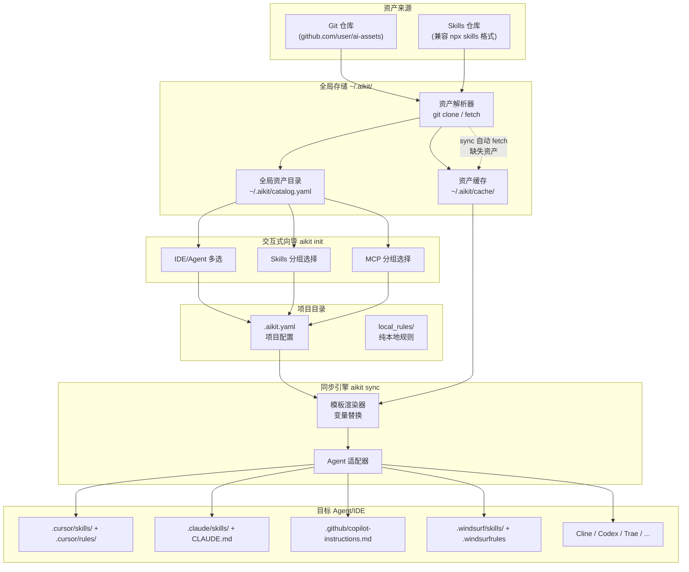

# aikit - 统一 AI 开发资产管理 CLI

> **Share your AI rules. Sync with your team.**
> **共享规则，协作开发。**

## 解决什么问题

核心诉求是**协作与共享**：项目里积累的各种 AI 规则（Skills、Rules、MCP、Commands）应当能像代码一样被版本管理、在团队内共享、在新成员/新环境中一键还原，而不是锁在各 IDE 的私有目录里。

当下 AI 编码 IDE 很多——Cursor、Claude Code、GitHub Copilot、Windsurf……每个工具格式不同，带来三个问题：

1. **规则难共享**：同一条「用中文回复」在 Cursor 是 `.mdc`，在 Claude Code 是 `CLAUDE.md`，在 Copilot 又是另一套。格式不统一，无法直接复用和分享。
2. **团队难协作**：项目里沉淀的规则散落在各自电脑、各自 IDE 里，新成员入职或换设备后无法一键拿到，只能口口相传或零散文档。
3. **积累难复用**：社区和团队里的优秀规则、skill、MCP 配置没有统一的收藏与分发方式，每次都要手动复制粘贴。

**aikit 围绕「共享与协作」**：用统一的 `.aikit.yaml` 声明项目要用的资产，`aikit sync` 自动同步到各 IDE；把 `.aikit.yaml` 随项目提交，其他人 clone 后一条 `aikit sync` 即可还原同一套 AI 开发环境，项目积累的规则真正可共享、可协作。

## 1. 生态现状与定位

已有工具：

- **npx skills** (Vercel, 7.4k stars): 只管 skill 安装，支持 37+ agent，用 symlink/copy 分发
- **rule-porter**: 只做 Cursor rule 到 CLAUDE.md/AGENTS.md 的单次转换
- **ai-rulez**: 统一配置但生态小

**aikit 的定位**：不是替代 npx skills，而是做 **AI 资产（skills + rules + MCP）的统一管理器**，重点解决：

- 跨平台规则同步（rule-porter 只做单次转换，aikit 做持续同步）
- MCP 配置统一管理（目前无人做）
- 资产分享（`.aikit.yaml` 随项目提交，团队成员一键还原 AI 开发环境）
- 兼容 Agent Skills 规范，可从 `npx skills` 生态的仓库安装 skills

## 2. 核心架构

核心流程分为三个阶段：**注册** → **选取** → **同步**。




**三阶段说明：**

1. `**aikit catalog add`（全局注册）**：自动扫描来源（远程 Git 仓库或本地目录），发现其中的资产（SKILL.md / asset.yaml 等），交互式选择后注册到全局资产目录 `~/.aikit/catalog.yaml`，并缓存到 `~/.aikit/cache/`。本地资产可通过 `aikit catalog publish --remote <repo>` 推送到指定远程仓库
2. `**aikit init` / `aikit add`（项目配置）**：通过 `init` TUI 向导从全局目录中选取，或通过 `add` 直接从远程/全局目录添加，写入项目级 `.aikit.yaml`
3. `**aikit sync`（同步分发）**：根据 `.aikit.yaml` 配置，从远程 source 拉取资产（本地无缓存时自动 fetch），通过 Agent 适配器同步到各目标 IDE

**三者关系：远程仓库（任意结构）→ catalog（个人收藏）→ .aikit.yaml（项目配置）→ IDE**

- 远程仓库不需要遵循特定规范，aikit 自动扫描发现资产（见 3.5 资产发现规则）
- `catalog.yaml` 是用户个人的资产收藏库，跨项目复用，方便 `init` 时选择
- `.aikit.yaml` 是项目级配置，随项目提交到 Git，团队成员 clone 后 `aikit sync` 即可还原完整的 AI 开发环境

## 3. 资产类型定义

### 3.1 Skill（兼容 Agent Skills 规范）

格式完全兼容 `npx skills` 生态，使用 `SKILL.md` + YAML frontmatter：

```yaml
---
name: ai-tech-topic-radar
description: Generates topic ideas for a personal AI technical blog...
---
# 内容正文（markdown）
```

安装策略：symlink（默认）或 copy，分发到各 agent 的 skills 目录。

### 3.2 Rule（跨平台规则）

几乎所有 AI 编码 IDE 都有「规则/指令」机制，用于指导 AI 的行为，但格式各不相同：


| IDE            | 规则格式                         | 存放位置                               | 文件范围控制   |
| -------------- | -------------------------------- | -------------------------------------- | -------------- |
| Cursor         | `.mdc`（frontmatter + markdown） | `.cursor/rules/*.mdc`                  | 支持 globs     |
| Claude Code    | 纯 markdown                      | `CLAUDE.md`（项目根目录及子目录）      | 靠目录层级控制 |
| GitHub Copilot | 纯 markdown                      | `.github/copilot-instructions.md`      | 不支持         |
| Windsurf       | 纯文本 / 规则文件                | `.windsurfrules` 或 `.windsurf/rules/` | 部分支持       |
| Cline          | 纯文本                           | `.clinerules`                          | 不支持         |
| Trae           | 规则文件                         | `.trae/rules/`                         | 部分支持       |


aikit 定义统一的规则标准格式，由适配器自动转换为各平台格式：

```yaml
# rules/respond-in-chinese/asset.yaml
kind: rule
metadata:
  name: respond-in-chinese
  description: "始终用中文回复"
  version: "1.0.0"
spec:
  content_file: content.md       # 规则正文（markdown 文件）
  globs: ["**/*.md", "**/*.txt"] # 文件匹配模式（见下方说明）
  always_apply: true             # 是否对所有文件生效
  variables:                     # 模板变量（渲染时替换）
    lang:
      default: "Chinese-simplified"
      description: "响应语言"
```

`**globs` 字段说明：**

`globs` 控制规则的生效文件范围，使用标准 glob 匹配模式：

- `["**/*.go"]` → 只在操作 Go 文件时生效
- `["**/*.md", "**/*.txt"]` → 只在 markdown 和文本文件上生效
- `["src/api/**"]` → 只在 `src/api/` 目录下生效
- `always_apply: true` → 忽略 globs，对所有文件生效

**各平台适配策略（sync 输出）：**

aikit 管理统一的 rule 标准格式，sync 时由各 Agent 适配器转换为目标 IDE 的原生格式。`CLAUDE.md`、`AGENTS.md` 等都只是输出格式之一，不是特殊存在：


| 目标 IDE       | 输出格式                              | 输出方式                 | globs 处理                 |
| -------------- | ------------------------------------- | ------------------------ | -------------------------- |
| Cursor         | `.cursor/rules/xxx.mdc`               | 每条 rule 一个文件       | 写入 frontmatter，原生支持 |
| Claude Code    | `CLAUDE.md`                           | 多条 rule 合并为一个文件 | 转为文本注释               |
| GitHub Copilot | `.github/copilot-instructions.md`     | 多条 rule 合并           | 转为文本注释               |
| Windsurf       | `.windsurfrules` / `.windsurf/rules/` | 单/多文件                | 部分版本支持               |
| AGENTS.md 兼容 | `AGENTS.md`                           | 多条 rule 合并           | 通过子目录放置控制范围     |


**合并文件的 sync 策略（CLAUDE.md / AGENTS.md / copilot-instructions.md）：**

对于需要将多条 rule 合并到单文件的平台，aikit 使用标记注释划定管理区域，避免覆盖用户手写内容：

```markdown
# CLAUDE.md

这是我手写的内容，aikit 不会修改这部分。

<!-- aikit:managed:begin -->
## respond-in-chinese
始终用中文回复

## coding-standards
遵循团队编码规范
<!-- aikit:managed:end -->
```

- `aikit sync` 只重写 `aikit:managed:begin` 与 `aikit:managed:end` 之间的内容
- 标记外的手写内容完整保留
- 文件已存在但无标记 → 在末尾追加标记区域
- 文件不存在 → 创建新文件并写入标记区域

### 3.3 MCP 配置

```yaml
# mcps/playwright/asset.yaml
kind: mcp
metadata:
  name: playwright
  description: "Browser automation via Playwright"
spec:
  transport: stdio                # 传输方式：stdio | sse
  command: "npx"                  # 启动命令
  args: ["-y", "@anthropic/mcp-playwright"]  # 命令参数
  env:                            # 环境变量
    DISPLAY: ":1"
  platform_overrides:             # 各平台差异化配置（见下方说明）
    cursor:
      server_instructions: "Use browser_navigate before browser_lock..."
```

`**platform_overrides` 字段说明：**

不同 IDE 对 MCP 的配置方式存在差异，`platform_overrides` 允许针对特定平台覆盖默认配置：

```yaml
platform_overrides:
  cursor:
    # Cursor 独有：MCP 工具使用指南，会注入到 AI 的系统提示中
    server_instructions: "Use browser_navigate before browser_lock..."
  claude-code:
    # Claude Code 可能需要不同的环境变量
    env:
      HEADLESS: "true"
  windsurf:
    # Windsurf 可能需要不同的启动参数
    args: ["-y", "@anthropic/mcp-playwright", "--headless"]
```

各字段均为可选，未覆盖的字段沿用 `spec` 中的默认值。aikit 的 Agent 适配器在生成各平台 MCP 配置时，会自动合并 `spec` 默认值和对应平台的 `platform_overrides`。

### 3.4 Command（自定义斜杠命令）

多个 IDE 支持自定义斜杠命令（`/command-name`），本质是命名的 prompt 模板，用户输入命令名即可触发预设的提示词：


| IDE         | 命令机制          | 存放位置                |
| ----------- | ----------------- | ----------------------- |
| Cursor      | 自定义 `/command` | `.cursor/commands/*.md` |
| Claude Code | 自定义 `/command` | `.claude/commands/*.md` |


aikit 标准格式：

```yaml
# commands/review/asset.yaml
kind: command
metadata:
  name: review
  description: "代码安全审查"
spec:
  content_file: content.md    # 命令的 prompt 内容
  variables:
    focus:
      default: "security"
      description: "审查重点"
```

```markdown
<!-- commands/review/content.md -->
对选中的代码进行安全审查，重点检查：
- SQL 注入
- XSS 跨站脚本
- 敏感信息泄露
- 权限校验缺失

审查重点: {{ focus }}
```

各平台适配策略：


| 目标 IDE     | 输出格式       | 输出位置                     |
| ------------ | -------------- | ---------------------------- |
| Cursor       | markdown 文件  | `.cursor/commands/review.md` |
| Claude Code  | markdown 文件  | `.claude/commands/review.md` |
| 不支持的 IDE | 跳过（不生成） | -                            |


command 与 rule 的区别：rule 是**被动**生效的（AI 自动遵循），command 是**主动**触发的（用户输入 `/review` 才执行）。

### 3.5 资产发现规则

aikit 不要求远程仓库遵循特定的「资产仓库规范」。`aikit catalog add` 和 `aikit add` 在扫描远程仓库时，通过以下规则自动发现资产：


| 发现方式           | 识别条件                                      | 资产类型                           |
| ------------------ | --------------------------------------------- | ---------------------------------- |
| `SKILL.md` 文件    | 目录中存在 `SKILL.md`（兼容 npx skills 规范） | Skill                              |
| `asset.yaml` 文件  | 文件中有 `kind: rule`                         | Rule                               |
| `asset.yaml` 文件  | 文件中有 `kind: mcp`                          | MCP                                |
| `asset.yaml` 文件  | 文件中有 `kind: command`                      | Command                            |
| `.aikit.yaml` 文件 | 仓库根目录存在 `.aikit.yaml`                  | 整套项目配置（用于 `init --from`） |


扫描是递归的，仓库内的任意层级目录都会被检查。这意味着以下仓库结构 aikit 都能识别：

```
# 结构 A：按类型分目录（推荐）
repo/
├── skills/
│   └── code-review/SKILL.md
├── rules/
│   └── respond-in-chinese/asset.yaml
└── mcps/
    └── playwright/asset.yaml

# 结构 B：扁平结构
repo/
├── code-review/SKILL.md
├── respond-in-chinese/asset.yaml
└── playwright/asset.yaml

# 结构 C：就是一个项目，里面有 .aikit.yaml
repo/
├── .aikit.yaml
├── src/
└── README.md
```

无论哪种结构，aikit 都能正确发现并注册资产。

## 4. CLI 命令设计

```
aikit
├── init [--from <source>]                 # 交互式初始化项目 / 从远程配置初始化
├── add [<source>] --skill/--rule/--mcp/--command  # 添加资产到项目 .aikit.yaml
├── remove --skill/--rule/--mcp/--command <name>   # 从项目 .aikit.yaml 移除资产
├── list                                  # 列出当前项目的资产
├── sync [--target <agent>...]            # 同步到目标 agent（如 cursor, claude-code）
├── publish --remote <repo> [flags]       # 发布项目中本地创建的资产到远程仓库
├── diff                                  # 预览 sync 会做什么变更
├── import <path>                         # 导入现有 IDE 配置为 aikit 标准格式
├── catalog                               # 全局资产目录管理
│   ├── add <source> [flags]              # 注册资产到全局目录（远程仓库 / 本地目录）
│   ├── remove --skill/--rule/--mcp/--command <name>  # 从全局目录移除
│   ├── list [--type skill|rule|mcp|command]          # 列出全局目录（按分组显示）
│   ├── update [<source>]                 # 更新已缓存的远程资产（git pull）
│   └── sync [--remote <repo>]            # 同步全局目录到远程仓库（多设备同步）
└── version
```

### 核心命令详解

#### `aikit add` - 添加资产到当前项目

`aikit add` 是**项目级操作**，将资产添加到当前项目的 `.aikit.yaml`。支持两种用法：

**用法 1：从远程仓库直接添加到项目**（不要求资产在全局 catalog 中）

```bash
aikit add silenceper/ai-assets --skill ai-tech-topic-radar
aikit add silenceper/ai-assets --mcp playwright
aikit add silenceper/ai-assets --rule respond-in-chinese
```

行为：fetch 远程仓库 → 写入 `.aikit.yaml` → 缓存到 `~/.aikit/cache/`。

**用法 2：从全局 catalog 添加到项目**（不指定 source）

```bash
aikit add --skill ai-tech-topic-radar
aikit add --mcp playwright
```

行为：从全局 catalog 中查找该资产 → 自动填充 `source` → 写入 `.aikit.yaml`。如果 catalog 中找不到，报错并提示 `请先运行 aikit catalog add 注册该资产`。

**重复添加行为：**

当 `.aikit.yaml` 中已存在同名资产时，提示是否更新：

```
$ aikit add silenceper/ai-assets --skill ai-tech-topic-radar
⚠ skill ai-tech-topic-radar 已存在于当前项目
? 是否更新? (Y/n)
✅ 已更新
```

#### `aikit catalog add` - 注册资产到全局目录

`aikit catalog add` 是**全局操作**，扫描来源（远程仓库或本地目录）中的资产，注册到 `~/.aikit/catalog.yaml` 并缓存。注册后的资产可在 `aikit init` 向导中被选取，也可通过 `aikit add --skill xxx`（不指定 source）快速添加到项目。

```bash
# ── 远程来源 ──

# 注册单个 skill，指定分组
aikit catalog add silenceper/ai-assets --skill ai-tech-topic-radar --group "写作与文档"

# 注册 MCP
aikit catalog add silenceper/ai-assets --mcp playwright --group "浏览器与测试"

# 不指定 --group 则归入 "未分组"
aikit catalog add vercel-labs/agent-skills --skill find-skills

# ── 本地来源 ──

# 从当前目录扫描注册
aikit catalog add . --skill my-skill --group "团队规范"

# 从指定本地路径
aikit catalog add ./my-rules --rule my-rule --group "团队规范"
```

**交互式批量注册：**

不指定具体资产名时，自动扫描并列出所有发现的资产，用户交互式勾选：

```
$ aikit catalog add silenceper/ai-assets

🔍 正在扫描 silenceper/ai-assets ...

发现 3 个 skills, 2 个 rules, 1 个 mcp:

? 选择要注册的资产 (空格选择，回车确认):

  Skills
  [x] ai-tech-topic-radar — AI 技术博客选题生成
  [x] code-review — 代码审查最佳实践
  [ ] testing-guide — 测试编写指南

  Rules
  [x] respond-in-chinese — 始终用中文回复
  [ ] coding-standards — 团队编码规范

  MCP
  [x] playwright — 浏览器自动化

? 统一分组名称 (留空则按资产类型自动分组): silenceper

✅ 已注册 4 个资产到全局目录
```

本地来源同样支持交互式批量注册：

```
$ aikit catalog add .

🔍 正在扫描当前目录 ...

发现 1 个 skill, 1 个 command:

? 选择要注册的资产:
  [x] my-skill — 自定义 skill
  [x] review — 代码安全审查

✅ 已注册 2 个资产到全局目录（来源: 本地）
   运行 aikit catalog publish --remote <repo> 可推送到远程仓库
```

**重复添加行为：**

已存在的资产提示是否更新缓存：

```
$ aikit catalog add silenceper/ai-assets --skill ai-tech-topic-radar
⚠ 资产 ai-tech-topic-radar (skill) 已存在于全局目录
? 是否更新缓存中的资产文件? (Y/n)
✅ 已更新
```

#### `aikit publish` - 发布项目本地资产到远程仓库

`aikit publish` 是**顶级命令**（不在 catalog 下），用于将当前项目中用户创建的本地资产发布到远程仓库。

**发现逻辑：** 扫描项目中所有 IDE 的 skill 目录（`.cursor/skills/`、`.claude/skills/` 等），排除 symlink（那些是 `aikit sync` 安装的），剩下的就是用户本地创建的资产。

```bash
# 指定资产发布
aikit publish --remote silenceper/my-ai-assets --skill my-skill

# 不指定资产名 → 交互式选择
aikit publish --remote silenceper/my-ai-assets
```

**交互式选择（不指定资产名时）：**

```
$ aikit publish --remote silenceper/my-ai-assets

Found 2 local skill(s) in project

? Select skills to publish (空格选择，回车确认):
  [x] my-skill — 自定义 skill
  [ ] draft-skill — 草稿，暂不发布

Pushing to silenceper/my-ai-assets...
  Published skill: my-skill
  Updated .aikit.yaml source references.
  Updated catalog source references.

1 skill(s) published to silenceper/my-ai-assets
```

publish 后，`.aikit.yaml` 和 `catalog.yaml` 中对应资产的 source 自动更新为远程仓库地址：

```yaml
# publish 前
- name: my-skill
  source: _local
  
# publish 后
- name: my-skill
  source: silenceper/my-ai-assets
```

#### `aikit catalog update` - 更新已缓存资产

```bash
aikit catalog update                        # 更新所有已缓存的远程仓库（git pull）
aikit catalog update silenceper/ai-assets   # 只更新指定仓库
```

#### `aikit init` - 交互式项目初始化向导

使用 [charmbracelet/huh](https://github.com/charmbracelet/huh) 构建 TUI 交互体验，分步引导用户选择：

```
$ aikit init

? 项目名称: my-awesome-project          ← 自动从目录名推断，可修改

? 选择你使用的 IDE/Agent (空格选择，回车确认):
  [x] Cursor          ← 已检测到，默认勾选
  [x] Claude Code     ← 已检测到，默认勾选
  [ ] GitHub Copilot
  [ ] Windsurf
  [ ] Cline
  [ ] Trae
  ...

? 选择要使用的 Skills:                   ← 从 ~/.aikit/catalog.yaml 读取，按 group 分组

  写作与文档
  [x] ai-tech-topic-radar — AI 技术博客选题生成
  [ ] doc-writer — 文档自动生成

  代码质量
  [x] code-review — 代码审查最佳实践
  [ ] testing-guide — 测试编写指南

  未分组
  [ ] find-skills — 查找和安装 agent skills

? 选择要使用的 MCP 服务:                 ← 同样从 catalog 读取，按 group 分组

  浏览器与测试
  [x] playwright — 浏览器自动化 (Playwright)

  开发工具
  [ ] github-mcp — GitHub API 集成

即将生成 .aikit.yaml:
  项目:   my-awesome-project
  IDE:    Cursor, Claude Code
  Skills: ai-tech-topic-radar, code-review
  MCP:    playwright

? 确认创建? (Y/n)

✅ 已生成 .aikit.yaml
   运行 aikit sync 同步到你的 IDE
```

**向导行为说明：**

- IDE 列表来自已实现的 Agent 适配器，已检测到安装的 IDE 自动预选
- Skills / MCP 列表来自全局资产目录 `~/.aikit/catalog.yaml`，按 `group` 字段分组展示
- 如果全局目录中暂无 Skills 或 MCP，跳过对应步骤并提示：`全局目录中暂无 skills，可用 aikit catalog add 添加`
- 支持 accessible mode：在无 TUI 支持的终端自动降级为逐行 prompt

`**--from` 模式：从远程配置初始化**

支持从远程 `.aikit.yaml` 直接初始化项目，无需先 clone 整个仓库：

```bash
# 从 GitHub 仓库根目录读取 .aikit.yaml
aikit init --from silenceper/team-config

# 从完整 URL 读取
aikit init --from https://raw.githubusercontent.com/silenceper/team-config/main/.aikit.yaml
```

执行流程：

```
$ aikit init --from silenceper/team-config

🔍 正在获取 silenceper/team-config/.aikit.yaml ...

已获取远程配置:
  项目:   team-config
  IDE:    Cursor, Claude Code
  Skills: ai-tech-topic-radar, code-review
  MCP:    playwright

? 项目名称: my-project              ← 可修改
? 确认使用此配置? (Y/n)

✅ 已生成 .aikit.yaml
   运行 aikit sync 同步到你的 IDE
```

这使得团队配置分享无需 clone 项目——只需一条命令即可复用他人的 AI 开发环境配置。

#### `aikit sync` - 核心同步命令

`aikit sync` 读取当前项目的 `.aikit.yaml`，将其中声明的资产同步到目标 IDE。如果本地缓存中没有对应资产，会**自动从 source 字段指定的远程仓库拉取**。

这意味着：当其他人 clone 了包含 `.aikit.yaml` 的项目后，无需手动 `aikit add`，直接 `aikit sync` 即可一键还原完整的 AI 开发环境。

```bash
# 自动检测已安装的 agent，全部同步（缺失的资产自动从远程拉取）
aikit sync

# 只同步到指定 agent
aikit sync --target cursor --target claude-code

# 预览模式（不实际写入，展示将要执行的操作）
aikit sync --dry-run

# 从 Cursor 反向导入新创建的 rule
aikit sync --import-from cursor
```

**sync 执行流程：**

```
读取 .aikit.yaml
  ↓
遍历 assets（skills / rules / mcps / commands）
  ↓
对每个资产检查 ~/.aikit/cache/ 是否已有缓存
  ├─ 有缓存 → 直接使用
  └─ 无缓存 → 根据 source 字段 git clone/fetch，写入缓存
  ↓
通过 Agent 适配器写入目标 IDE 的对应目录
```

## 5. 项目配置文件 `.aikit.yaml`

资产中的 `source` 与 catalog 一致：支持 GitHub shorthand、完整 HTTPS/SSH URL、公有/私有 Git 仓库；本地资产为 `_local`（仅当从 catalog 添加且尚未 publish 时可能出现）。

```yaml
project:
  name: silenceper-blog
  targets: [cursor, claude-code, copilot]  # 可选，默认自动检测

assets:
  skills:
    - source: silenceper/ai-assets
      name: ai-tech-topic-radar
      variables:
        blog_url: "https://silenceper.com"
        focus_areas: ["AI Agent", "Cloud Native"]
    - source: vercel-labs/agent-skills
      name: find-skills

  rules:
    - source: silenceper/ai-assets
      name: respond-in-chinese
      variables:
        lang: "Chinese-simplified"

  mcps:
    - source: silenceper/ai-assets
      name: playwright

  commands:
    - source: silenceper/ai-assets
      name: review
      variables:
        focus: "security"

local_rules:
  - content: "不要直接修改代码和文档，除非我已经明确你可以修改代码"
    always_apply: true
  - content: "本项目使用 Hugo 生成静态站点"
    globs: ["content/**/*.md"]
```

## 6. 全局资产目录 `~/.aikit/catalog.yaml`

全局资产目录是 `aikit catalog add` 和 `aikit init` 之间的桥梁。`aikit catalog add` 将资产注册到此文件，`aikit init` 从此文件读取可选资产列表，`aikit add --skill xxx`（不指定 source）也从此文件查找资产。

```yaml
skills:
  - name: ai-tech-topic-radar
    source: silenceper/ai-assets
    description: "AI 技术博客选题生成"
    group: "写作与文档"
  - name: code-review
    source: silenceper/ai-assets
    description: "代码审查最佳实践"
    group: "代码质量"
  - name: find-skills
    source: vercel-labs/agent-skills
    description: "查找和安装 agent skills"
    group: "未分组"

rules:
  - name: respond-in-chinese
    source: silenceper/ai-assets
    description: "始终用中文回复"
    group: "语言与风格"
  - name: coding-standards
    source: silenceper/ai-assets
    description: "团队编码规范"
    group: "代码质量"

mcps:
  - name: playwright
    source: silenceper/ai-assets
    description: "浏览器自动化 (Playwright)"
    group: "浏览器与测试"
  - name: github-mcp
    source: silenceper/ai-assets
    description: "GitHub API 集成"
    group: "开发工具"

commands:
  - name: review
    source: silenceper/ai-assets
    description: "代码安全审查"
    group: "代码质量"
  - name: explain
    source: silenceper/ai-assets
    description: "解释选中代码的逻辑"
    group: "未分组"
  - name: security-check
    source: _local                    # 本地注册的资产，publish 后更新为远程地址
    description: "安全漏洞扫描"
    group: "团队规范"
```

**字段说明：**

- `name`: 资产名称，全局唯一标识（同类型下不允许重名）
- `source`: 来源标识。远程资产支持 GitHub shorthand（如 `silenceper/ai-assets`）、完整 HTTPS URL（如 `https://github.com/silenceper/ai-assets.git`）或 SSH URL（如 `git@gitlab.company.com:team/ai-assets.git`），兼容 GitHub、GitLab、Gitea 等公有/私有 Git 仓库；本地资产为 `_local`（publish 后自动更新为远程地址）
- `description`: 资产描述，在 `aikit init` 向导中展示（从资产元数据自动提取，或用户手动指定）
- `group`: 分组名称，用于向导中的分组展示。未指定时默认为 `"未分组"`

**全局目录结构：**

```
~/.aikit/
├── catalog.yaml      # 全局资产目录（aikit catalog add 写入，aikit init 读取）
├── skills/           # 本地创建的 skill（aikit catalog add . 写入）
│   └── my-skill/
│       └── SKILL.md
├── rules/            # 本地创建的 rule
├── commands/         # 本地创建的 command
│   └── security-check/
│       ├── asset.yaml
│       └── content.md
└── cache/            # 远程仓库 clone 缓存（可通过 catalog update 重建）
    ├── silenceper/
    │   └── ai-assets/          # 远程仓库按 owner/repo 组织
    │       ├── skills/
    │       └── commands/
    └── vercel-labs/
        └── agent-skills/
            └── skills/
```

缓存规则：远程资产按 `source` 规范化为目录——GitHub shorthand 对应 `owner/repo`；完整 URL 则从 URL 解析出 org/repo 或生成稳定目录名，保证同一 source 始终落同一缓存目录。本地资产存放在 `~/.aikit/skills/`、`~/.aikit/rules/`、`~/.aikit/commands/` 等顶级目录。

`aikit catalog sync` 可将 `catalog.yaml` 和本地资产文件同步到私有远程仓库，实现多设备间的全局收藏同步。`aikit publish` 则将项目中用户创建的资产发布到公开仓库供他人使用。两者使用系统已有 git 认证（SSH 或 HTTPS），无需在 aikit 内配置。

## 7. 资产分享机制

`.aikit.yaml` 是 aikit 的资产分享载体，类似 `go.mod` 之于 Go、`package.json` 之于 Node.js。

**典型入口**：新用户可直接 `aikit init --from user/repo` 用他人配置初始化项目；或先 `aikit catalog add user/repo` 收藏资产，再 `aikit init` 在向导里按需勾选。

### 分享原理

`.aikit.yaml` 中每个资产都记录了 `source`（远程 Git 仓库地址）和 `name`（资产名称），这两个字段足以让 aikit 定位并拉取任何资产。将 `.aikit.yaml` 随项目代码提交到 Git，即完成分享。

### 典型场景

**场景 1：团队共享 AI 开发环境**

方式 A：随项目代码分享

```
项目作者                                          团队成员
────────                                          ────────
aikit catalog add silenceper/ai-assets            git clone team-project
  → 交互式选择要注册的资产                          cd team-project
aikit init → 选择资产 → .aikit.yaml               aikit sync  ← 一键还原
git add .aikit.yaml && git push
```

方式 B：不 clone 项目，直接从远程配置初始化（更轻量）

```
项目作者                                          团队成员
────────                                          ────────
将 .aikit.yaml 提交到                             cd my-project
  silenceper/team-config 仓库                     aikit init --from silenceper/team-config
                                                  aikit sync  ← 一键还原
```

成员无需关心资产来自哪个仓库，`aikit sync` 自动根据 `.aikit.yaml` 中的 `source` 从远程拉取。

**场景 2：开源项目提供推荐 AI 配置**

开源项目维护者可以在仓库中提供 `.aikit.yaml`，声明推荐的 skills、rules 和 MCP：

```yaml
# .aikit.yaml - 随项目一起分发
project:
  name: my-oss-project
  targets: [cursor, claude-code]

assets:
  skills:
    - source: silenceper/ai-assets
      name: code-review
    - source: silenceper/ai-assets
      name: testing-guide
  rules:
    - source: silenceper/ai-assets
      name: respond-in-chinese
  mcps:
    - source: silenceper/ai-assets
      name: playwright
```

贡献者 clone 后 `aikit sync` 即可获得一致的 AI 辅助开发体验。也可以不 clone，直接：

```bash
aikit init --from someone/my-oss-project
```

**场景 3：发布资产供他人使用**

任何 Git 仓库都可以作为资产来源，只要其中包含 aikit 能识别的资产文件（`SKILL.md`、`asset.yaml` 等，详见 3.5 资产发现规则）。无需遵循特定的仓库结构规范，aikit 会自动递归扫描发现资产。

其他用户可以收藏到全局目录：

```bash
aikit catalog add someone/my-ai-assets
# → 自动扫描仓库，交互式选择要注册哪些资产
```

也可以跳过 catalog，直接添加到项目：

```bash
aikit add someone/my-ai-assets --skill code-review
```

**场景 4：发布项目中本地创建的资产**

用户在项目中创建了 skill，发布到远程仓库供团队使用：

```
开发者
────────
# 在项目的 .cursor/skills/ 中创建了 my-skill
# 直接发布到远程（扫描 IDE 目录，排除 symlink，交互式选择）
aikit publish --remote silenceper/my-ai-assets
  → 发现 my-skill（非 symlink，用户创建）
  → 推送到 silenceper/my-ai-assets
  → .aikit.yaml 和 catalog 中 source 更新为 silenceper/my-ai-assets

其他人
────────
# 方式 A：收藏到 catalog
aikit catalog add silenceper/my-ai-assets
  → 自动发现 my-skill 等资产

# 方式 B：直接添加到项目
aikit add silenceper/my-ai-assets --skill my-skill
```

**场景 5：多设备同步个人全局收藏**

将全局 catalog 和本地资产同步到私有仓库，实现跨设备一致体验：

```
设备 A
────────
aikit catalog add vercel-labs/agent-skills   # 注册远程资产
aikit catalog add . --skill my-local-skill   # 注册本地资产
aikit catalog sync --remote user/my-catalog  # 首次设置并同步（私有仓库）

设备 B
────────
aikit catalog sync --remote user/my-catalog  # 拉取全部（catalog.yaml + 本地资产文件）
aikit catalog update                         # 重建远程资产缓存
```

### 与 Homebrew Tap 的对比


| 维度           | Homebrew Tap                              | aikit                                  |
| -------------- | ----------------------------------------- | -------------------------------------- |
| 分享载体       | 独立 tap 仓库 + `brew tap` 命令           | `.aikit.yaml` 随项目提交               |
| 使用方式       | `brew tap user/repo` → `brew install pkg` | `aikit sync` 或 `aikit init --from`    |
| 是否需要预注册 | 是（必须先 tap）                          | 否（sync 自动 fetch 缺失资产）         |
| 是否需要 clone | -                                         | 否（`init --from` 直接从远程读取配置） |
| 适合场景       | 分发独立软件包                            | 分享项目级 AI 开发配置                 |


aikit 的方案更轻量：不需要额外的 tap 注册步骤，`.aikit.yaml` 自描述、自包含。两种使用路径都不需要手动操作：

- **有项目仓库**：clone 后 `aikit sync` 一键还原
- **无项目仓库**：`aikit init --from user/repo` 直接从远程配置初始化

## 8. Agent 适配器架构

每个 agent 实现统一接口：

```go
type Agent interface {
    Name() string
    Detect() bool                              // 检测是否安装
    InstallSkill(skill *Skill, method string) error  // symlink or copy
    InstallRule(rule *RenderedRule) error       // 格式转换后写入
    InstallMCP(mcp *MCPConfig) error           // 写 MCP 配置
    InstallCommand(cmd *Command) error         // 写入 commands 目录
    SupportsCommand() bool                     // 是否支持自定义命令
    ListInstalled() ([]Asset, error)           // 列出已安装资产
    ImportRules() ([]Rule, error)              // 反向导入规则
    ProjectSkillDir() string                   // e.g. ".cursor/skills/"
    GlobalSkillDir() string                    // e.g. "~/.cursor/skills/"
}
```

MVP 支持的 agent（按优先级）：

1. **Cursor** - `.cursor/skills/` + `.cursor/rules/*.mdc` + `.cursor/commands/`
2. **Claude Code** - `.claude/skills/` + `CLAUDE.md` + `.claude/commands/`
3. **GitHub Copilot** - `.agents/skills/` + `.github/copilot-instructions.md`
4. **Windsurf** - `.windsurf/skills/` + `.windsurfrules`
5. **AGENTS.md** - 通用格式

后续扩展按 npx skills 的 37+ agent 列表逐步添加。

### 完整 Agent 目录对照表（参考 npx skills 生态，aikit MVP 以本小节上方列表为准）

| Agent          | `--agent` flag   | 项目级 Skills 路径  | 全局 Skills 路径              |
| -------------- | ---------------- | ------------------- | ----------------------------- |
| Cursor         | `cursor`         | `.cursor/skills/`   | `~/.cursor/skills/`           |
| Claude Code    | `claude-code`    | `.claude/skills/`   | `~/.claude/skills/`           |
| Codex          | `codex`          | `.agents/skills/`   | `~/.codex/skills/`            |
| GitHub Copilot | `github-copilot` | `.agents/skills/`   | `~/.copilot/skills/`          |
| Windsurf       | `windsurf`       | `.windsurf/skills/` | `~/.codeium/windsurf/skills/` |
| Cline          | `cline`          | `.agents/skills/`   | `~/.agents/skills/`           |
| Trae           | `trae`           | `.trae/skills/`     | `~/.trae/skills/`             |
| Roo Code       | `roo`            | `.roo/skills/`      | `~/.roo/skills/`              |
| OpenCode       | `opencode`       | `.agents/skills/`   | `~/.config/opencode/skills/`  |
| Gemini CLI     | `gemini-cli`     | `.agents/skills/`   | `~/.gemini/skills/`           |
| Amp            | `amp`            | `.agents/skills/`   | `~/.config/agents/skills/`    |
| Augment        | `augment`        | `.augment/skills/`  | `~/.augment/skills/`          |
| Continue       | `continue`       | `.continue/skills/` | `~/.continue/skills/`         |
| Goose          | `goose`          | `.goose/skills/`    | `~/.config/goose/skills/`     |
| Kilo Code      | `kilo`           | `.kilocode/skills/` | `~/.kilocode/skills/`         |


## 9. 反向同步（IDE -> aikit）

用户在 Cursor 中新建了一个 rule，aikit 可以检测并提供导入：

```bash
aikit sync --import-from cursor
# 检测到 .cursor/rules/ 中有 2 个未被 aikit 管理的规则:
#   - new-rule.mdc (created 2 hours ago)
#   - coding-style.mdc (created 1 day ago)
#
# ? 导入 new-rule.mdc? [Y/n/local]
#   Y = 导入为通用资产（存入资产仓库，可分享）
#   n = 跳过
#   local = 加入 local_rules（仅本项目）
```

也可以做成一个 Cursor skill，提醒 agent 在创建 rule 后执行 `aikit sync --import-from cursor`。

## 10. 项目结构

```
aikit/
├── cmd/                          # cobra 命令
│   ├── root.go
│   ├── init.go                   # 交互式项目初始化（调用 wizard）
│   ├── add.go                    # 添加资产到项目 .aikit.yaml
│   ├── remove.go                 # 从项目移除资产
│   ├── list.go                   # 列出项目资产
│   ├── sync.go
│   ├── diff.go
│   ├── import_cmd.go
│   ├── publish.go                # 发布项目本地资产到远程仓库
│   └── catalog.go                # catalog 子命令（add/remove/list/update/sync）
├── internal/
│   ├── asset/                    # 资产模型
│   │   ├── types.go              # Skill, Rule, MCP, Command
│   │   └── registry.go           # 本地注册表 (YAML)
│   ├── catalog/                  # 全局资产目录管理
│   │   └── catalog.go            # Catalog CRUD（读写 ~/.aikit/catalog.yaml）
│   ├── wizard/                   # 交互式向导（基于 charmbracelet/huh）
│   │   ├── wizard.go             # 向导主流程编排
│   │   ├── agent_select.go       # IDE/Agent 多选（含自动检测预选）
│   │   └── asset_select.go       # Skills/MCP 分组多选
│   ├── agent/                    # Agent 适配器
│   │   ├── interface.go          # Agent interface
│   │   ├── util.go               # 文件复制工具
│   │   ├── cursor.go
│   │   ├── claude.go
│   │   ├── copilot.go
│   │   ├── windsurf.go
│   │   └── agentsmd.go
│   ├── rule/                     # Rule 处理
│   │   ├── parser.go             # 解析各平台 rule 格式
│   │   ├── renderer.go           # 模板变量渲染
│   │   └── merger.go             # 多 rule 合并为单文件
│   ├── skill/                    # Skill 处理
│   │   ├── discovery.go          # 在 repo 中发现 SKILL.md
│   │   └── installer.go          # symlink / copy
│   ├── mcp/                      # MCP 配置管理
│   │   └── converter.go
│   ├── command/                  # Command 处理
│   │   ├── discovery.go          # 在 repo 中发现 command
│   │   └── installer.go          # 写入各 IDE 的 commands 目录
│   └── source/                   # 资产来源解析
│       ├── resolver.go           # 解析 git URL / shorthand / local path
│       └── git.go                # git clone / pull
├── pkg/
│   └── config/                   # 配置文件读写
│       ├── project.go            # .aikit.yaml
│       └── global.go             # ~/.aikit/catalog.yaml
├── go.mod
├── go.sum
├── main.go
└── README.md
```

## 11. 分阶段实施

### Phase 1 - MVP（核心链路跑通）

- Go 项目骨架 + cobra CLI + `charmbracelet/huh` 依赖
- 资产模型定义（types.go：Skill, Rule, MCP, Command）
- 全局资产目录 `~/.aikit/catalog.yaml` 的 CRUD（internal/catalog/）
- `aikit catalog add <source>` 交互式注册资产到全局目录（远程仓库 + 本地目录）
- `aikit catalog list` 列出全局目录中的资产（按分组显示）
- `aikit catalog update` 更新已缓存资产
- `aikit catalog sync --remote <repo>` 同步全局目录到私有远程仓库（多设备同步）
- `aikit publish --remote <repo>` 发布项目本地资产到远程仓库
- Skill 发现逻辑（兼容 Agent Skills 规范的目录搜索）
- `aikit init` 交互式向导（internal/wizard/）：
  - 项目名称输入（自动推断）
  - IDE/Agent 多选（含自动检测预选）
  - Skills 分组多选（从 catalog 读取）
  - MCP 分组多选（从 catalog 读取）
  - 确认并生成 `.aikit.yaml`
- `aikit add` 添加资产到项目（从远程 / 从 catalog）
- `aikit remove` 从项目移除资产
- `aikit list` 列出当前项目资产
- `aikit sync` 同步到 Cursor + Claude Code（缺失资产自动从远程 source 拉取）
- Cursor + Claude Code + Windsurf + Copilot adapter
- `.aikit.yaml` 分享机制：clone 项目后 `aikit sync` 一键还原 AI 开发环境

### Phase 2 - Rules 跨平台同步

- Rule 标准格式定义（asset.yaml + content.md）
- `aikit catalog add --rule` / `aikit add --rule` 支持规则
- Rule 模板渲染（变量替换）
- `aikit init` 向导增加 Rules 分组选择步骤
- Cursor .mdc 生成器
- CLAUDE.md / copilot-instructions.md 合并生成器
- `aikit sync --import-from cursor` 反向导入
- Copilot + Windsurf + AGENTS.md adapter

### Phase 3 - 扩展功能

- `aikit diff` 预览变更
- 更多 agent adapter
- `aikit import` 导入现有 IDE 配置

### Phase 4 - UI + 生态

- `aikit ui` 启动本地 Web UI
- 远程资产索引源（从 URL 拉取 catalog 扩展）
- skills.sh 目录集成
- 发布到 Homebrew

